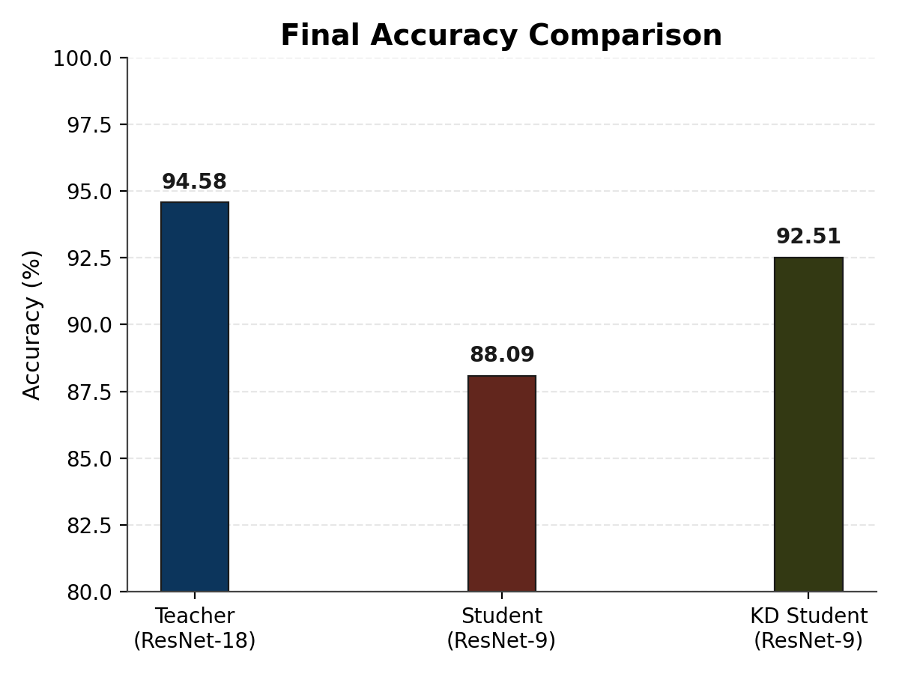

# CIFAR-10 Knowledge Distillation

This project compares a stronger teacher model against a smaller student model on CIFAR-10 and then improves the student with knowledge distillation.

## Models

- Teacher: ResNet-18
- Student: ResNet-9
- KD Student: ResNet-9 trained with soft targets from the ResNet-18 teacher

## Project Files

- `dataset.py`: CIFAR-10 dataloaders and data augmentation
- `models.py`: teacher and student model definitions
- `train_teacher.py`: train the teacher model
- `train_student.py`: train the student baseline
- `train_KD.py`: train the distilled student

## Results

<div align="center">
<table>
  <tr>
    <td valign="top">

| Model | Role | Method | Acc (%) |
| --- | --- | --- | ---: |
| ResNet-18 | Teacher | Supervised | 94.58 |
| ResNet-9 | Student | Supervised | 88.09 |
| ResNet-9 | KD Student | KD | 92.51 |

<sub>Trained ResNet-18 and ResNet-9 using supervised learning, then distilled knowledge from the ResNet-18 teacher into the ResNet-9 student using KD.</sub>

  </td>
    <td valign="top" align="center">
      
      <br>
      <sub>Comparison of teacher, student, and KD student accuracy on CIFAR-10.</sub>
    </td>
  </tr>
</table>
</div>

## How To Run

Install dependencies:

```bash
pip install -r requirements.txt
```

Train the teacher:

```bash
python train_teacher.py
```

Train the student baseline:

```bash
python train_student.py
```

Train the distilled student:

```bash
python train_KD.py
```

## Saved Weights

- `kd_student.pth`: distilled ResNet-9 weights created after running `train_KD.py`

## Notes

- Resume checkpoints are ignored by git and are not pushed to GitHub.
- The teacher weights should be saved as `teacher.pth` before running `train_KD.py`.
- The distilled student weights are saved as `kd_student.pth`.
